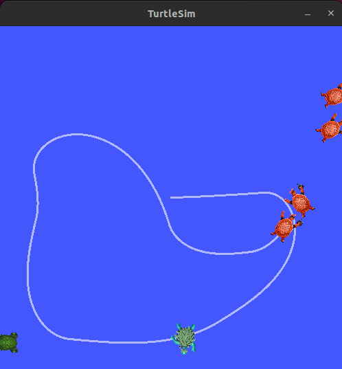

## About
This is a C++ implementation of the final project for the [ROS2 for Beginners](https://www.udemy.com/course/ros2-for-beginners/) course on Udemy.

The basic idea of the project is to create a turtle spawner node and a turtle controller node. The turtle spawner will periodically generate random turtle positions and then request a new turtle at that location from the standard turtlesim node.  The turtle controller will send commands to the initial turtle to navigate to the closest turtle and "catch" it. The initial turtle is controlled using a very simple proportional controller.

This project requires an understanding the following ROS2 concepts:
 - Nodes
 - Topics
 - Services
 - Parameters
 - Launch Files

# Demo

## Installation
To try it out you will need ros2 humble installed and a corresponding workspace. Clone this repository into the `src` directory of your ros2 workspace and build it with `colcon build --packages-select turtle_catcher`.

You will also need the [turtlesim package](http://wiki.ros.org/turtlesim) if it's not already installed. It can be installed with `sudo apt-get install ros-humble-turtlesim`

Start the project with the launch file by running `ros2 run turtle_catcher turtle_catcher.launch.py`
